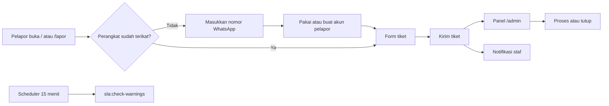
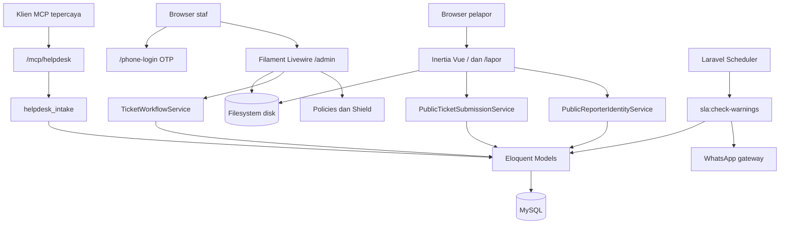

<p align="center">
  
</p>

<h1 align="center">Helpdesk</h1>

<p align="center">
  Sistem helpdesk berbasis web untuk pengajuan, penugasan, dan penyelesaian
  tiket dukungan terkait produk dan layanan organisasi.
</p>

Helpdesk menyediakan tiga jalur penggunaan:

- **Form tiket publik** di `/` dan `/lapor` untuk pelapor tanpa masuk ke panel.
- **Panel staf Filament** di `/admin` untuk operasional tiket.
- **MCP opsional/legacy** di `/mcp/helpdesk` untuk klien atau gateway tepercaya; bukan alur utama pengguna.

Bahasa utama aplikasi adalah Bahasa Indonesia (locale `id`) dan seluruh perhitungan waktu menggunakan zona waktu `Asia/Jakarta`.

> [!IMPORTANT]
> Form publik **tidak** memverifikasi kepemilikan nomor WhatsApp. Nomor berfungsi sebagai identitas pencocokan dan kontak, bukan bukti bahwa perangkat milik pemilik nomor. Ikatan browser (`helpdesk_reporter_bindings`) juga bukan bukti kepemilikan. Jangan membuka `/mcp/helpdesk` ke klien yang tidak tepercaya: endpoint itu memakai bearer token dan bukan pengganti form publik.

## Daftar isi

- [Tujuan dan scope](#tujuan-dan-scope)
- [Fitur utama](#fitur-utama)
- [Role dan hak akses](#role-dan-hak-akses)
- [Cara kerja aplikasi](#cara-kerja-aplikasi)
- [Arsitektur](#arsitektur)
- [Tech stack](#tech-stack)
- [Persiapan development](#persiapan-development)
- [Konfigurasi environment](#konfigurasi-environment)
- [Menjalankan aplikasi](#menjalankan-aplikasi)
- [MCP opsional](#mcp-opsional)
- [Scheduler SLA](#scheduler-sla)
- [Workflow development](#workflow-development)
- [Testing dan quality check](#testing-dan-quality-check)
- [Batasan dan technical debt](#batasan-dan-technical-debt)
- [Troubleshooting](#troubleshooting)

## Tujuan dan scope

Helpdesk menyatukan pengajuan tiket oleh pelapor dan penanganan tiket oleh staf unit. Alur utamanya dimulai dari form publik, identitas pelapor berbasis nomor WhatsApp pada perangkat, pembuatan tiket, lalu pengelolaan di panel staf sampai tiket diproses atau ditutup.

### Termasuk dalam scope

- Form pengajuan tiket publik di `/` dan `/lapor` (pengalaman yang sama).
- Identitas pelapor berbasis nomor WhatsApp kanonik (`users.phone_normalized`) dan ikatan perangkat.
- Panel staf Filament di `/admin`: tiket, unit, kategori masalah, status, entitas bisnis, pengguna, SLA unit, dan pengaturan MCP.
- Prioritas tiket, komentar, lampiran, dan riwayat tiket.
- Role `Super Admin`, `Admin Unit`, `Staff Unit`, `Master Admin`, dan `User`.
- Login panel dengan email/kata sandi, OTP WhatsApp di `/phone-login`, dan Socialite Google untuk akun yang sudah ada.
- Peringatan SLA terjadwal (`sla:check-warnings` setiap 15 menit).
- Integrasi MCP opsional di `/mcp/helpdesk` (intake) dan `/mcp/helpdesk/staff` (perintah alur staf).

### Di luar scope implementasi saat ini

- Aplikasi mobile terpisah; pelapor memakai form Inertia di repositori ini, staf memakai panel Filament.
- Registrasi mandiri di panel, reset password panel, dan pembuatan akun baru lewat Socialite. Ketiganya dinonaktifkan; akun staf dibuat oleh administrator.
- Produk REST API domain. `routes/api.php` hanya mengekspos `GET /api/user` untuk user terautentikasi Sanctum.
- Pipeline CI/CD, image container, atau orkestrasi Compose di repositori ini.

## Fitur utama

Ketersediaan modul pada setiap surface saat ini:

| Modul | Form `/` `/lapor` | Panel `/admin` | MCP `/mcp/helpdesk` | Keterangan |
|---|:---:|:---:|:---:|---|
| Identitas pelapor (nomor WhatsApp) | Ya | Tidak | Ya | Form tidak memakai OTP; MCP memverifikasi lewat OTP atau assertion gateway |
| Buat tiket | Ya | Ya | Ya | `owner_id` tiket ditentukan server, bukan dari hidden input |
| Kelola tiket (assign, proses, tutup) | Tidak | Ya | Tidak | Status: Open, In Progress, Cancel, Closed. Perintah staf ada di `/mcp/helpdesk/staff` |
| Komentar dan lampiran | Lampiran saat buat | Ya | Tidak | MCP intake tidak mengekspos komentar atau update |
| Master unit, kategori, status, entitas | Tidak | Ya | Tidak | Dipakai sebagai opsi form setelah identitas terikat |
| Prioritas tiket | Ya | Ya | Default Medium | Seed: Critical/Urgent, High, Medium, Low, Enhancement/Feature Request |
| Dashboard dan widget SLA | Tidak | Ya | Tidak | Peringatan SLA juga dikirim lewat scheduler |
| Pengguna dan role | Tidak | Ya | Tidak | Permission Filament Shield |
| Pengaturan MCP | Tidak | Super Admin | — | `/admin/pengaturan-mcp` |
| Login OTP WhatsApp | Tidak | `/phone-login` | — | Membutuhkan `WAG_URL` dan `WAG_TOKEN` |
| Login Google | Tidak | `/auth/google` | — | Hanya akun Helpdesk yang sudah ada |

> [!NOTE]
> MCP adalah jalur integrasi opsional/legacy. Pengajuan tiket utama tetap form publik. Kontrak alat, token, gateway, dan cutover production ada di [`docs/mcp/README.md`](docs/mcp/README.md).


## Role dan hak akses

Role awal dari seeder adalah `Super Admin`, `Admin Unit`, `Staff Unit`, `Master Admin`, dan `User`.

Hak akses panel ditentukan permission Filament Shield pada masing-masing role, lalu dipersempit lagi oleh policy dan keanggotaan unit. Nama role saja tidak cukup; periksa [`app/Policies`](app/Policies) dan helper di [`app/Models/User.php`](app/Models/User.php).

### Akses efektif panel web

| Aktor | Akses utama |
|---|---|
| `Super Admin` | Seluruh permission, termasuk Pengaturan MCP. Akses tiket global. |
| `Master Admin` | Master data (unit, kategori, status, user, SLA unit) dan tiket lintas unit. Bukan Super Admin: halaman Pengaturan MCP menolak akses. |
| `Admin Unit` | Tiket, kategori, entitas bisnis, komentar, dan tampilan SLA pada unit yang ditugaskan. |
| `Staff Unit` | Melihat, membuat, dan memperbarui tiket serta komentar pada unit yang ditugaskan. |
| `User` | Permission pelapor (lihat/buat tiket dan komentar). Role di-seed, tetapi akun contoh `user@cs.com` **tidak** di-assign role ini. |
| Pelapor form publik | Tidak memakai panel. Akun minimal berbasis nomor telepon; `tickets.owner_id` menghubungkan tiket ke pelapor. |

Hanya user aktif yang dapat masuk panel. `User::canAccessPanel()` menolak akun nonaktif, dan mengizinkan login bila email terverifikasi **atau** sesi OTP WhatsApp (`helpdesk_phone_verified_user_id`) cocok.

`Super Admin` dan `Master Admin` memiliki akses tiket global (`hasGlobalTicketAccess()`). `Admin Unit` dan `Staff Unit` hanya memproses tiket pada unit yang ditugaskan (`user_entities` / `unit_id`).

### Akun uji development

Kredensial berikut hanya dibuat oleh `php artisan db:seed` / `migrate --seed`. Jangan membuat atau mempertahankan kata sandi tetap ini pada lingkungan production.

| Nama seed | Email | Role yang di-assign | Kata sandi |
|---|---|---|---|
| Super Admin | `superadmin@cs.com` | `Super Admin` | `password` |
| Admin Unit | `adminunit@cs.com` | `Admin Unit` (unit id 1) | `password` |
| Staff Unit | `staffunit@cs.com` | `Staff Unit` (unit id 1) | `password` |
| User | `user@cs.com` | *tidak di-assign* | `password` |

Role `Master Admin` di-seed tanpa akun contoh. Unit seed: `BUSDEV` dan `IT`.


## Cara kerja aplikasi



### 1. Form publik dan identitas pelapor

Pengajuan tiket utama dilakukan melalui form publik pada dua alamat berikut:

```text
https://helpdesk.example.com/
https://helpdesk.example.com/lapor
```

Kedua alamat menampilkan pengalaman pengajuan yang sama. `GET /` dan `GET /lapor` merender form; `POST /lapor` menyimpan tiket. Panel staf tetap terpisah di `/admin`.

#### Pelapor pertama kali pada suatu perangkat

1. Pelapor memasukkan nomor WhatsApp.
2. Sistem menormalkan nomor ke format kanonik dan memakai pengguna Helpdesk aktif yang sudah memiliki nomor tersebut.
3. Jika nomor belum ditemukan, sistem membuat akun pelapor minimal berbasis nomor telepon di basis data Helpdesk. Pelapor tidak perlu mengisi nama atau kode OTP.
4. Browser/perangkat diikat ke akun pelapor dan form tiket ditampilkan.

Alur publik ini sengaja tidak melakukan verifikasi kepemilikan nomor. Pelapor harus memastikan nomor yang dimasukkan benar dan dapat dihubungi.

#### Pelapor yang sudah pernah menggunakan perangkat tersebut

Sistem mengenali ikatan browser yang masih valid, menampilkan nomor WhatsApp tersamarkan, dan langsung membuka bagian laporan tiket. Pelapor tidak perlu mengisi ulang informasi penginput sehingga dapat berfokus pada tujuan unit, kategori, judul, deskripsi, prioritas, entitas bisnis, dan lampiran tiket.

`owner_id` tiket selalu ditentukan oleh server dari ikatan nomor pada perangkat. Form tidak menerima identitas pelapor dari hidden input atau parameter URL.

#### Mengganti pelapor

Tautan **Ganti nomor** mengakhiri ikatan akun pada perangkat tersebut dan menghapus identitas lokalnya. Pengguna berikutnya harus memasukkan nomor WhatsApp sebelum mengirim tiket. Gunakan tindakan ini pada perangkat bersama atau ketika kontak pelapor perlu diganti.

#### Menggunakan basis data yang sudah ada

Form publik tidak memerlukan tabel reporter baru. Implementasinya memakai struktur yang sudah tersedia:

- `users.phone_normalized` menyimpan nomor WhatsApp kanonik untuk pencocokan identitas, termasuk saat migrasi data dilakukan kemudian.
- `helpdesk_reporter_bindings` menyimpan pemetaan akun pelapor yang diingat per browser/perangkat, termasuk waktu pengikatan, penggunaan terakhir, dan pencabutan. Ikatan ini bukan bukti kepemilikan nomor.
- `tickets.owner_id` menghubungkan setiap laporan ke pelapor yang benar.

Data nama dan nomor tidak disalin ke tabel tiket. Pencocokan identitas pada migrasi mendatang dapat menggunakan `users.phone_normalized`; data resmi harus memperbarui baris pengguna yang sama, bukan membuat pengguna baru. Dengan begitu riwayat tiket yang sudah ada tetap terhubung melalui `tickets.owner_id`.

### 2. Pengelolaan tiket di panel

1. Administrator menyiapkan unit, kategori masalah, status, prioritas, entitas bisnis, SLA unit, dan akun staf.
2. Tiket masuk berstatus `Open`.
3. Staf unit yang berwenang memproses tiket menjadi `In Progress` (PIC), menambahkan komentar/lampiran, lalu menutup (`Closed`) atau membatalkan (`Cancel`).
4. Policy membatasi siapa yang boleh melihat, mengubah, dan memproses tiket: pemilik dapat mengubah tiket miliknya selama masih `Open`; staf memproses tiket unitnya; Super Admin / Master Admin lintas unit.

Alur transisi staf yang sama dipakai perintah MCP staf (`proses` / `done`) di `/mcp/helpdesk/staff`.

### 3. Login staf

- Email dan kata sandi di `/admin/login`.
- OTP WhatsApp di `/phone-login` (membutuhkan gateway `WAG_URL` / `WAG_TOKEN`). Registrasi akun baru dari alur OTP hanya untuk karyawan yang cocok di berkas Talenta; pelapor publik tidak memakai halaman ini.
- Google OAuth di `/auth/google`. Registrasi Socialite dinonaktifkan; login ditolak bila akun Helpdesk belum ada.

Reset password dan halaman profil default Filament dimatikan. Staf mengubah data pribadi lewat My Profile Breezy yang didaftarkan panel.

## Arsitektur



### Peta source code

| Lokasi | Tanggung jawab |
|---|---|
| `app/Filament/Resources` | CRUD tiket, unit, kategori, status, user, entitas bisnis, SLA |
| `app/Filament/Pages` | Dashboard, My Profile, Pengaturan MCP |
| `app/Filament/Widgets` | Grafik status tiket dan SLA |
| `app/Filament/Auth` | Halaman login OTP WhatsApp |
| `app/Http/Controllers` | Form publik dan callback Socialite |
| `app/Mcp` | Server dan alat MCP intake/staf |
| `app/Models` | Model dan relasi Eloquent |
| `app/Policies` | Authorization panel |
| `app/Services` | Identitas pelapor, pembuatan tiket, workflow, OTP, WhatsApp, Talenta |
| `app/Console/Commands` | `sla:check-warnings` |
| `database/migrations` | Evolusi schema |
| `database/seeders` | Data awal development |
| `routes/web.php` | Form publik, phone-login, Socialite |
| `routes/ai.php` | Endpoint MCP HTTP |
| `routes/console.php` | Jadwal SLA |
| `routes/api.php` | `GET /api/user` (Sanctum) |
| `resources/js/pages/PublicTickets` | Halaman Inertia form publik |
| `tests` | Unit dan feature test |
| `docs/mcp/README.md` | Kontrak dan operasional MCP |
| `screenshot/` | Gambar alur dan skema untuk README ini |


## Tech stack

| Komponen | Teknologi |
|---|---|
| Backend | PHP `^8.2`, Laravel 12 |
| Admin UI | Filament 4, Livewire, Mekaya Theme |
| Form publik | Inertia.js 3, Vue 3 |
| Frontend build | Vite 8, Tailwind CSS 4, Axios |
| Database | MySQL (default `.env.example`); SQLite in-memory untuk test |
| Filesystem | Disk Laravel `local` / `public`; disk `s3` opsional |
| Auth panel | Filament login, Breezy profile, Socialite Google, OTP WhatsApp |
| Authorization | Filament Shield / Spatie Permission |
| MCP | Laravel MCP (`/mcp/helpdesk`, stdio `helpdesk`) |
| Notifikasi | Mail + WhatsApp gateway (`WAG_URL`, `WAG_TOKEN`) |
| Test | PHPUnit 11 / `php artisan test` |
| Formatter | Laravel Pint |

## Persiapan development

### Prasyarat

- Git.
- PHP 8.2 atau lebih baru.
- Composer 2.
- Node.js 20.19+ atau 22.12+ (Vite 8).
- MySQL 8+ (atau MariaDB yang kompatibel) untuk development sesuai `.env.example`.
- Extension PHP yang biasa dipakai Laravel/Filament, termasuk `curl`, `fileinfo`, `gd`, `intl`, `mbstring`, `openssl`, `pdo_mysql`, dan `xml`.

Gateway WhatsApp, Google OAuth, S3, dan Redis bersifat opsional untuk menjalankan form publik dan panel dasar. OTP login dan notifikasi WhatsApp membutuhkan `WAG_URL` serta `WAG_TOKEN`.

### Clone dan dependency

```bash
git clone https://github.com/oceanspacedev/helpdesk-web.git
cd helpdesk-web

composer install
cp .env.example .env
php artisan key:generate
npm ci
```

Jangan menjalankan `composer update` hanya untuk setup; gunakan versi dependency yang dikunci oleh `composer.lock`.

### Konfigurasi database

`.env.example` memakai MySQL. Buat database kosong lalu sesuaikan koneksi:

```dotenv
APP_NAME=Helpdesk
APP_ENV=local
APP_DEBUG=true
APP_URL=http://127.0.0.1:8000

DB_CONNECTION=mysql
DB_HOST=127.0.0.1
DB_PORT=3306
DB_DATABASE=helpdesk
DB_USERNAME=root
DB_PASSWORD=
```

#### Fresh onboarding

Pastikan `.env` menunjuk ke database development yang kosong, lalu jalankan:

```bash
php artisan migrate --seed
php artisan storage:link
```

Perintah di atas setara dengan migrasi lalu seeder terpisah:

```bash
php artisan migrate
php artisan db:seed
php artisan storage:link
```

> [!WARNING]
> Jangan menjalankan `php artisan migrate:fresh`, `migrate:refresh`, atau `db:wipe` pada database yang berisi data. Perintah tersebut menghapus tabel/data. Jangan menjalankan seeder development di production.

Seeder membuat data contoh lokal (role, unit, prioritas, status, tiket contoh, dan akun di tabel di atas). Seeder tidak untuk dijalankan berulang atau di production.

## Konfigurasi environment

Jangan commit `.env` atau credential apa pun ke Git. Daftar berikut mengikuti [`.env.example`](.env.example).

| Variabel | Wajib | Fungsi |
|---|:---:|---|
| `APP_KEY` | Ya | Kunci enkripsi Laravel; dibuat dengan `php artisan key:generate` |
| `APP_URL` | Ya | Base URL aplikasi, asset, dan tautan |
| `APP_NAME` | Tidak | Nama tampilan; default `Helpdesk` |
| `APP_ENV` / `APP_DEBUG` | Ya | Environment dan debug |
| `DB_CONNECTION` / `DB_*` | Ya | Driver dan koneksi database; default proyek `mysql` |
| `CACHE_STORE` | Ya | Cache default; `.env.example` memakai `file`. Multi-instance production untuk MCP/OTP membutuhkan store bersama, biasanya Redis |
| `FILESYSTEM_DISK` | Ya | Disk filesystem default; `local`, `public`, atau `s3` |
| `SESSION_DRIVER` | Ya | Penyimpanan session; default `file` |
| `QUEUE_CONNECTION` | Ya | Backend queue; default `sync` |
| `REDIS_HOST` / `REDIS_PASSWORD` / `REDIS_PORT` | Jika Redis dipakai | Koneksi Redis untuk cache/session/lock bersama |
| `MAIL_*` | Untuk email | SMTP dan identitas pengirim; `.env.example` menunjuk Mailpit |
| `MAIL_TIMEOUT` | Tidak | Timeout SMTP dalam detik; default `10` agar hang mail tidak memakan `max_execution_time` |
| `WAG_URL` | Untuk WhatsApp | Endpoint gateway WhatsApp (OTP, notifikasi, peringatan SLA, MCP) |
| `WAG_TOKEN` | Untuk WhatsApp | Bearer credential gateway WhatsApp |
| `WA_CONNECT_TIMEOUT` | Tidak | Timeout koneksi gateway WhatsApp; default `5` detik |
| `WA_API_TIMEOUT` | Tidak | Timeout request gateway WhatsApp; default `8` detik |
| `PHONE_OTP_LOGIN_TTL_MINUTES` | Tidak | Umur tantangan OTP login; default `5` |
| `WHATSAPP_OTP_TTL_MINUTES` | Tidak | Umur OTP WhatsApp; default `5` |
| `GOOGLE_CLIENT_ID` / `GOOGLE_CLIENT_SECRET` / `GOOGLE_CLIENT_REDIRECT` | Untuk Google login | OAuth Socialite |
| `AWS_ACCESS_KEY_ID` / `AWS_SECRET_ACCESS_KEY` / `AWS_DEFAULT_REGION` / `AWS_BUCKET` | Untuk S3 | Disk `s3` di `config/filesystems.php` |
| `AWS_USE_PATH_STYLE_ENDPOINT` | Tidak | Path-style S3; default `false`. Set `true` plus `AWS_ENDPOINT` untuk MinIO atau S3-compatible |
| `INERTIA_SSR_ENABLED` | Tidak | SSR Inertia; default `false` |
| `HELPDESK_MCP_LOCAL_CLIENT_ID` | Tidak | ID klien MCP stdio lokal; unik per mesin klien |
| `TALENTA_EMPLOYEE_FILE` | Tidak | Override path JSON karyawan; default berkas di root repositori |

Proyek ini membaca cache lewat `CACHE_STORE` di `config/cache.php`. Setelah migration, token MCP server-wide dikelola di **Admin → Pengaturan → Pengaturan MCP**. Environment MCP lama tetap didukung sebagai fallback rollout; daftar lengkapnya ada di [`docs/mcp/README.md`](docs/mcp/README.md).

Untuk local development tanpa SMTP:

```dotenv
MAIL_MAILER=log
MAIL_FROM_ADDRESS=dev@example.test
MAIL_FROM_NAME="${APP_NAME}"
```

Form publik dan panel dasar tetap berjalan tanpa WhatsApp. Tanpa `WAG_TOKEN`, OTP login, notifikasi WhatsApp, dan intake MCP yang membutuhkan OTP tidak dapat menyelesaikan verifikasi.

## Menjalankan aplikasi

Jalankan backend dan Vite pada terminal terpisah:

```bash
php artisan serve
```

```bash
npm run dev
```

Buka:

- Form publik: `http://127.0.0.1:8000/` atau `http://127.0.0.1:8000/lapor`
- Panel staf: `http://127.0.0.1:8000/admin`
- Login OTP: `http://127.0.0.1:8000/phone-login`
- Health check: `http://127.0.0.1:8000/up`

Scheduler tidak wajib untuk UI, tetapi harus dijalankan bila sedang mengembangkan peringatan SLA:

```bash
php artisan schedule:work
```

Queue default adalah `sync`. Jalankan worker hanya jika `QUEUE_CONNECTION` diubah ke driver yang mengantri:

```bash
php artisan queue:work
```

Untuk frontend production-like:

```bash
npm run build
```

## MCP opsional

Endpoint HTTP:

```text
POST /mcp/helpdesk
POST /mcp/helpdesk/staff
```

Alat intake adalah `helpdesk_intake`. Stdio lokal (bukan daemon production):

```bash
php artisan mcp:start helpdesk
```

MCP **bukan** alur utama pelapor. Jangan mengarahkan pengguna akhir ke `/mcp/helpdesk` dari browser (GET mengembalikan HTTP 405; klien menginisialisasi dengan JSON-RPC `POST`).

Untuk instalasi klien, kontrak alat, token, gateway WhatsApp, percobaan ulang, dan cutover database production, lihat [dokumentasi MCP](docs/mcp/README.md). Use case terdahulu: [uc-004-mcp-create-ticket](docs/chain-of-truth/ucic/uc-004-mcp-create-ticket.md).

## Scheduler SLA

Scheduler menjalankan `sla:check-warnings` **setiap 15 menit**. Command mencari tiket aktif yang `sla_due_at`-nya tersisa ≤ 2 jam dan belum dikirimi peringatan, lalu memberi notifikasi Filament dan WhatsApp kepada PIC atau staf unit.

### Production scheduler

Laravel scheduler harus dipanggil setiap menit agar jadwal 15 menit berjalan:

```cron
* * * * * cd /absolute/path/to/helpdesk-web && /absolute/path/to/php artisan schedule:run >> storage/logs/scheduler.log 2>&1
```

Temukan binary PHP dengan `command -v php`. Pantau dan rotasi log scheduler. Command operasional lain:

| Command | Fungsi |
|---|---|
| `php artisan sla:check-warnings` | Cek dan kirim peringatan SLA sekarang |
| `php artisan schedule:work` | Menjalankan scheduler di proses foreground (local) |
| `php artisan optimize:clear` | Menghapus cache config, route, event, dan view |

## Workflow development

Branch default repositori adalah `main`. Buat cabang pekerjaan dari `main` dengan pola `feat/<scope>`, `fix/<scope>`, atau `docs/<scope>`.

### Memulai pekerjaan

```bash
git switch main
git pull --ff-only origin main
git switch -c feat/<nama-fitur>
```

Gunakan scope kecil dan satu tujuan per branch.

### Lokasi perubahan berdasarkan jenis fitur

| Kebutuhan | Lokasi umum |
|---|---|
| Tambah/ubah tabel | `database/migrations` dan `app/Models` |
| Identitas pelapor / form publik | `app/Http/Controllers/PublicTicketController.php`, `app/Services/Integrations`, `resources/js/pages/PublicTickets` |
| Logika tiket reusable | `app/Services` (`TicketWorkflowService`, layanan integrasi) |
| Hak akses panel | `app/Policies`, seeder permission/role, scoped query Filament |
| Fitur panel web | `app/Filament/Resources`, `Pages`, atau `Widgets` |
| MCP | `app/Mcp` dan `docs/mcp/README.md` |
| Background operation | `app/Console/Commands` dan `routes/console.php` |
| Verifikasi | `tests/Unit` atau `tests/Feature` |

### Aturan implementasi

- Jangan mengubah schema melalui migration yang sudah pernah berjalan di shared environment; tambahkan migration baru.
- Identitas pelapor selalu diselesaikan di server; jangan menerima `owner_id` dari klien.
- Perubahan konfigurasi wajib diikuti update `.env.example` dan README tanpa memasukkan secret.
- Tambahkan test regresi untuk setiap perbaikan bug pada form publik, policy, MCP, atau SLA.

### Definition of Done

Sebelum membuka PR, pastikan:

- Scope bisnis dan aktor yang boleh mengakses sudah jelas.
- Test terkait ditambahkan dan `php artisan test` berhasil.
- `npm run build` berhasil bila ada perubahan frontend/Filament asset.
- Tidak ada `.env`, token, dump database, data pribadi, atau credential di commit.

## Testing dan quality check

`phpunit.xml` mengunci test ke SQLite in-memory (`DB_CONNECTION=sqlite`, `DB_DATABASE=:memory:`), `CACHE_STORE=array`, session array, queue sync, dan mail array. Full test suite tidak menggunakan database development dari `.env`.

```bash
php artisan test
php artisan test --filter=NamaTest
```

Quality check yang didukung repositori:

```bash
vendor/bin/pint --test
composer validate --strict
npm run build
```

## Batasan dan technical debt

Daftar ini adalah batas perilaku aktual, bukan fitur yang dijanjikan:

1. **Form publik tidak membuktikan kepemilikan nomor.** Siapa pun yang mengetahui atau mengetik nomor dapat diikat ke akun pelapor pada perangkat itu.
2. **Akun seed `user@cs.com` tidak mendapat role `User`.** Role `User` ada di `RoleSeeder`; `UserSeeder` membuat user itu tanpa `syncRoles`.
3. **Role `Master Admin` tidak memiliki akun seed.** Hanya Super Admin, Admin Unit, dan Staff Unit yang punya login contoh.
4. **MCP bukan produk utama.** Dokumentasi operasional MCP tetap berbahasa Inggris di `docs/mcp/README.md` dan tidak diganti oleh README ini.
5. **Tidak ada REST API domain.** Jangan mengasumsikan klien mobile/API terpisah; satu-satunya route `routes/api.php` adalah `GET /api/user`.
6. **Queue default `sync`.** Notifikasi dan pekerjaan berjalan inline sampai `QUEUE_CONNECTION` diubah.
7. **Multi-instance membutuhkan store bersama.** Komentar di `.env.example` menyatakan Redis diperlukan agar draft MCP, OTP, registrasi, rate limit, dan lock terbagi.
8. **Registrasi panel, reset password, dan registrasi Socialite dimatikan.** Onboarding staf tetap manual / seeder / Talenta OTP.

## Troubleshooting

### Composer menolak versi PHP

Pastikan CLI memakai PHP 8.2 atau lebih baru:

```bash
php -v
composer check-platform-reqs
```

### Vite manifest not found

```bash
npm ci
npm run build
php artisan optimize:clear
```

### Perubahan config atau route tidak terbaca

```bash
php artisan optimize:clear
```

### Lampiran atau asset `/storage` 404

```bash
php artisan storage:link
```

### Form publik tidak mengingat pelapor

Periksa cookie `helpdesk_reporter_device`, session, dan bahwa `APP_URL` cocok dengan URL yang dibuka. Ganti nomor memakai tautan **Ganti nomor** pada form.

### OTP WhatsApp atau notifikasi tidak terkirim

1. Isi `WAG_URL` dan `WAG_TOKEN`.
2. Pastikan nomor pelapor/staf valid (format `08…` atau `62…`).
3. Periksa `storage/logs/laravel.log`.
4. Untuk peringatan SLA, jalankan `php artisan sla:check-warnings` dan pastikan scheduler aktif.

### `/mcp/helpdesk` 405 di browser

Itu disengaja. Endpoint hanya menerima `POST` JSON-RPC dari klien MCP. Lihat [`docs/mcp/README.md`](docs/mcp/README.md).

### Login panel ditolak

Pastikan user `is_active`, punya email terverifikasi **atau** baru menyelesaikan OTP di `/phone-login`, dan tidak memakai akun pelapor telepon-saja untuk masuk `/admin`.
